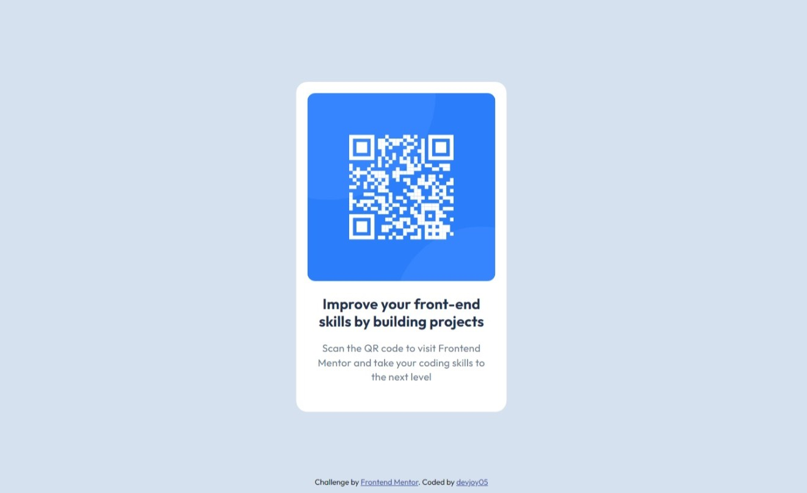

# Frontend Mentor - QR code component solution

This is a solution to the [QR code component challenge on Frontend Mentor](https://www.frontendmentor.io/challenges/qr-code-component-iux_sIO_H). Frontend Mentor challenges help you improve your coding skills by building realistic projects. 

## Table of contents

- [Overview](#overview)
  - [Screenshot](#screenshot)
  - [Links](#links)
- [My process](#my-process)
  - [Built with](#built-with)
  - [What I learned](#what-i-learned)
  - [Continued development](#continued-development)
- [Author](#author)

## Overview

### Screenshot

### Links

- Solution URL: (https://github.com/devjoy05/qr-code-component-main)
- Live Site URL: (https://devjoy05.github.io/qr-code-component-main/)

## My process

I used CSS positioning instead of the easier methods like Flexbox or Grid since it's an area I still find quite confusing. It didn’t work initially, but I got it right after remembering to apply the translate function.

### Built with

- Semantic HTML5 markup
- CSS custom properties

### What I learned
Using transform CSS property and translate function in conjunction with CSS positioning to center a single container on a page.

### Continued development

- Practicing and familiarizing myself more with CSS position, transform property and translate function.
- Creating more responsive design.

## Author

- Frontend Mentor - [@devjoy05](https://www.frontendmentor.io/profile/devjoy05)
